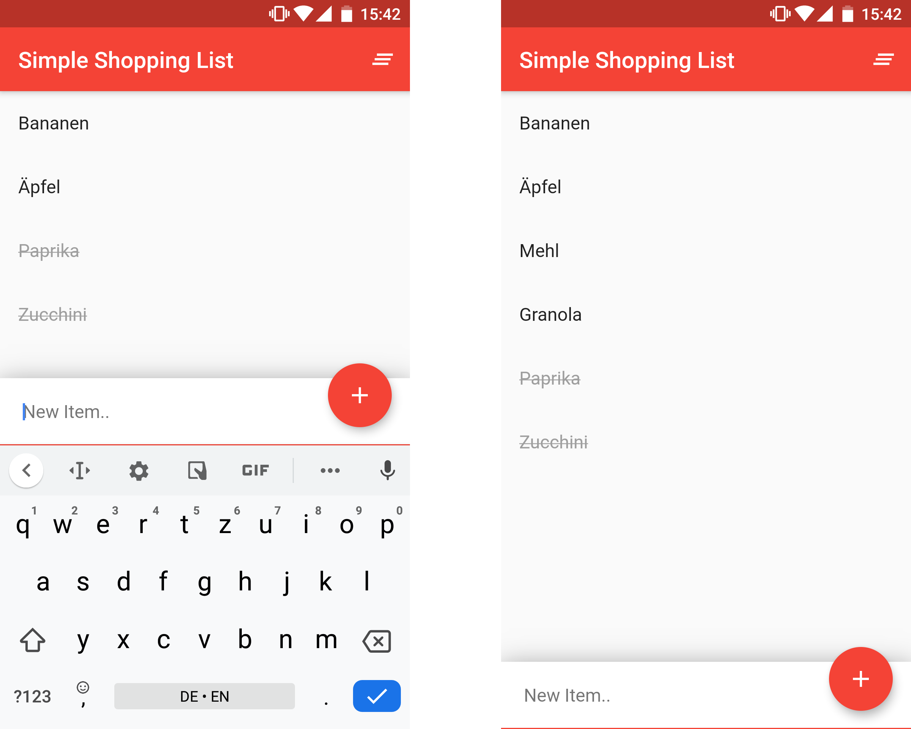
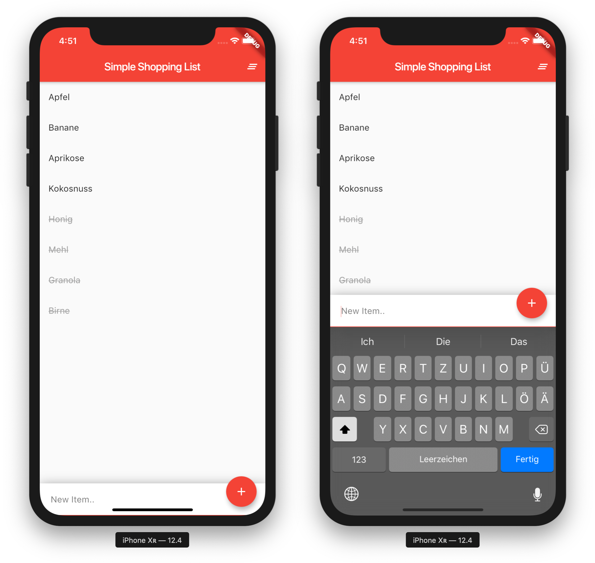

# Shopping List 🛒

A shopping list application, built using flutter.

## Screenshots 📱

### Android

### iOS

## Building 🛠️
Build the apk for this project using `flutter build apk` (this will build the *fat* apk for all targets) or using `flutter build apk --split-per-abi` to build to slim versions.

## Generating Icons 💁
Generate new icons by runnning `flutter pub run flutter_launcher_icons:main`
